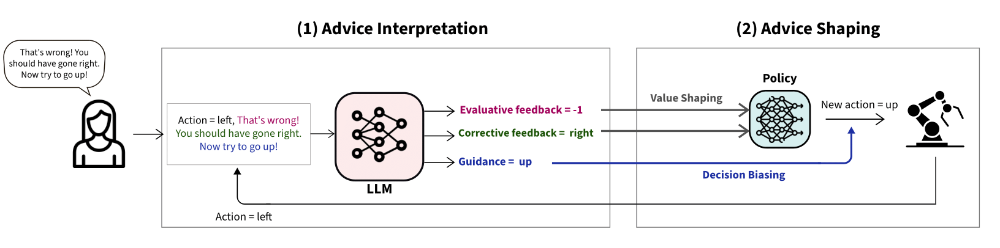

# Evaluative Corrective Guidance LAnguage as reInfoRcement (ECLAIR) 

### Codebase for : "Interactive Reinforcement Learning from Natural Language Feedback"

ECLAIR is a Reinforcement Learning (RL) framework that integrates different types of natural language feedback to interactively shape robots’ behaviours. The model consists of two phases:
1. **Advice interpretation:** we leverage the use of LLMs to translate the spoken feedback into different value, specifically evaluative feedback, corrective feedback, and guidance for the next action.
2. **Advice shaping:** this consists of integrating the different types of feedback in the RL algorithm to update and refine the policy of the robot. 

 

  

